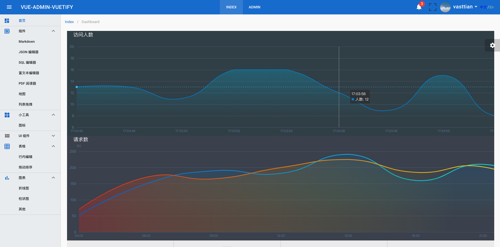
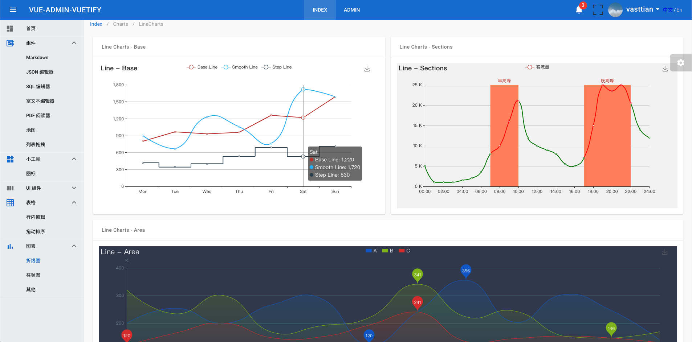
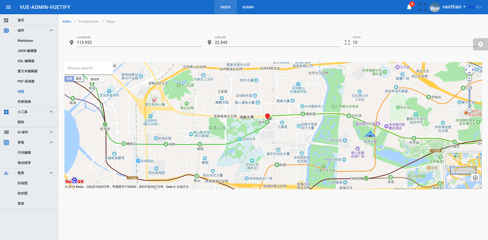

<!-- ## vue-admin-vuetify -->
<h2 align="center">Vuetify v2.0 is coming soon</h2>
<h2 align="center">vue-admin-vuetify</h2>
<p>
  <h4 align="center"><code>vue-admin-vuetify</code> is a Front-end component project.</h4>
  <h4 align="center">Component demo based on <a href="https://github.com/vuejs/vue">vue</a> and <a href="https://github.com/vuetifyjs/vuetify">vuetify</a></h4>
</p>

<p align="center">
  <a href="https://github.com/vasttian/vue-admin-vuetify/tags">
    
  </a>
  <a href="https://github.com/vasttian/vue-admin-vuetify/releases">
    
  </a>
  <a href="https://github.com/vasttian/vue-admin-vuetify/blob/master/LICENSE">
    
  </a>
</p>
<!-- [](https://github.com/vasttian/vue-admin-vuetify/tags) -->

---

### :page_with_curl: Index

* [:warning: Heads up](#warning-heads-up)
* [:art: Live Demo](#art-live-demo)
* [:rocket: Getting Started](#rocket-getting-started)
* [:camera: Screenshots](#camera-screenshots)
* [:white_check_mark: Roadmap](#white_check_mark-roadmap)
* [:exclamation: Issues](#exclamation-issues)
* [:copyright: License](#copyright-license)

### :warning: Heads up

Currently this is just a **beta version**.

### :art: Live Demo

[http://67.218.155.117:8020](http://67.218.155.117:8020)

### :rocket: Getting Started

#### Project setup

```bash
npm install
```

#### Compiles and hot-reloads for development

```bash
npm run serve
```

:tada: Open http://localhost:8090 to see the demo.

If [hot reload](https://vue-loader.vuejs.org/guide/hot-reload.html#state-preservation-rules) fails,
modify your `vue.config.js`

```javascript
module.exports = {
  chainWebpack: config => {
    config.resolve
      .symlinks(true)
  }
}
```

or replace `cnpm` with `npm`

`npm config set registry https://registry.npm.taobao.org`

#### Compiles and minifies for production

```bash
npm run build
```

#### Lints and fixes files

```bash
npm run lint
```

### :camera: Screenshots

|  |  |
|---|---|
|||
|||

### :white_check_mark: Roadmap

- [x] add: Dashboard.
- [x] add: Icons.
- [x] add: Editor components.
- [x] add: Jsonlint.
- [x] mod: Sidebar.
- [x] add: Charts components.
- [ ] add: UI components.
- [ ] add: Render Functions & Functional Components.
- [x] add: Demo site.

### :exclamation: Issues

If you run into any issues, you can contact me at [issues](https://github.com/vasttian/vue-admin-vuetify/issues)

### :memo: Changelog

Detailed changes for each release are documented in the [release notes](https://github.com/vasttian/vue-admin-vuetify/releases).

### :copyright: License

Under the MIT license. See [LICENSE](http://opensource.org/licenses/MIT) file for more details.
